Sreekar Tiruchunapally

**Part 1:**

For this project, I decided to use a dataset detailing the top 1000 streamers on Twitch.tv and their overall channel statistics from August 19th, 2019 to August 19th, 2020. This time period was a time of huge growth of the platform due to more people staying inside and consuming content due to the COVID-19 Pandemic. I thought that it would be interesting to see the statistics of individual streamers during this time and maybe gain some insight as to how the platform grew. This dataset is available at <https://www.kaggle.com/aayushmishra1512/twitchdata/version/3>.

In order to import this dataset into RStudio, I downloaded the .csv to my local machine and ran this code.

This dataset has both quantitative and qualitative statistics. The quantitative statistics that are available in this dataset are *Watch time(minutes)*, *Stream time(Minutes), Peak Viewers, Average viewers, Followers, Followers gained, Views gained*. The qualitative statistics are *Partnered, Mature,* and *Language*.

In order to provide a more comprehensive view of the overall data I chose to summarize the data. These summary statistics will be referenced throughout part 1.

Even within the top 1000 streamers on Twitch.tv, there is a huge amount of variation. For example, under the followers gained category, it is apparent that there is a streamer that actually lost 15772 followers while there was another streamer that gained 3966525 followers. Even with this relatively limited dataset with only 1000 entries, this variation can allow us to make some interesting observations using various types of tests in part 2.

For all of the quantitative variables, I chose to plot 2 histograms and 2 boxplots, one with outliers and one excluding outliers for both types of plots. The number of breaks in each histogram is the length of the data plotted divided by 20, which is a number that I found to represent the data very well. Further along in part 2, I will use the data without outliers as across the board, the data is more normal which is helpful in order to make sure that the tests that I perform are valid.This trimming of outliers was performed with this function:

**Watch Time (minutes):**

Total watch time for the streamer across all viewers for the past year.

|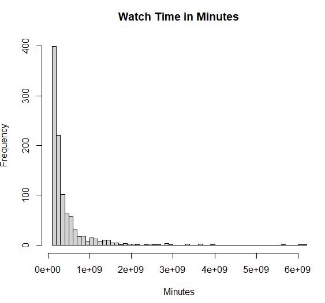|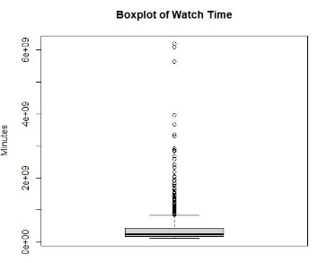|
| - | - |

|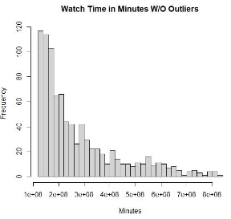|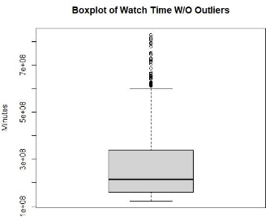|
| - | - |
For the *Watch Time* variable, the mean and median according to the summary statistics are very high while the mode is very low, this causes the shape of the histogram to be very right skewed. According to the boxplot, there are also a huge number of outliers present in the data. After removing these outliers, it is apparent that the histogram is still right skewed but the data is distributed more evenly. I wouldn’t say that this data is normally distributed though. The boxplot of watch time without outliers also shows that there are outliers present in the data. However, compared to the original boxplot, the new boxplot supports my conclusion that the new data is distributed more evenly.

**Stream time(Minutes):**

Total time spent live for the past year.

For the *Stream Time* variable, according to the summary statistics, the median is between the mode and the mean. This means that the data is right skewed. According to the boxplot, there are also a high number of outliers present in the data. After removing these outliers, it is apparent that the histogram is still a little right skewed but the data is almost normally distributed. The boxplot of stream time without outliers also shows that there are very few outliers present in the data. This data is obviously more symmetric as shown in the box plot.

**Peak Viewers:**

Highest number of viewers at any given time for the past year.

For the *Peak Viewers* variable, according to the summary statistics, the median is between the mode and the mean. This causes the histogram to be left skewed. According to the boxplot, there are also a huge number of outliers present in the data. After removing these outliers, it is

apparent that the histogram is still very right skewed but the data is distributed more evenly. The boxplot of peak viewers without outliers also shows that there are outliers present in the data. However, compared to the original boxplot, the new boxplot supports my conclusion that the new data is distributed more evenly.

**Average viewers:**

Average number of viewers across the past year.

|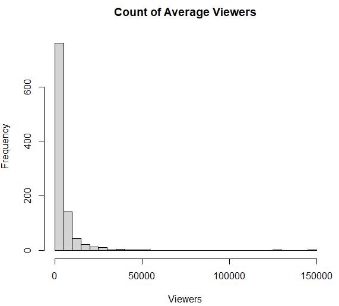|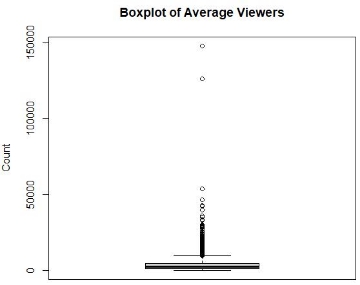|
| - | - |

|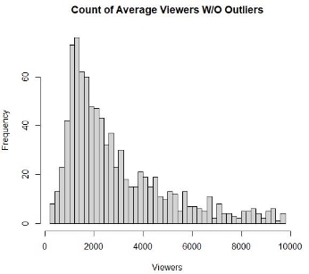|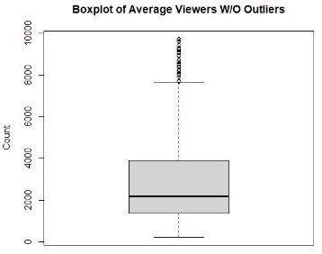|
| - | - |
For the *Average Viewers* variable, much like *Peak Viewers*, the median is between the mode and the mean. This causes the histogram to be right skewed. According to the boxplot, there are also a huge number of outliers present in the data with 2 individual points that are much higher than the others. After removing these outliers, it is apparent that the histogram is still very right skewed but the data is distributed more evenly. The boxplot of average viewers without outliers also shows that there are outliers present in the data. However, compared to the original boxplot, the new boxplot supports my conclusion that the new data is distributed more evenly.

**Followers:**

Total number of followers at the end of the year (August 19th, 2020).

For the *Followers* variable, according to the summary statistics, the median is between the mode and the mean. This causes the histogram to be right skewed. According to the boxplot, there are also a huge number of outliers present in the data. After removing these outliers, it is apparent that the histogram is still right skewed but the data is distributed more evenly. The boxplot of followers without outliers also shows that there are outliers present in the data. However, compared to the original boxplot, the new boxplot supports my conclusion that the new data is distributed more evenly.

**Followers gained:**

Difference in number of followers between August 19th, 2019 and August 19th, 2020.

For the *Followers Gained* variable, according to the summary statistics, the median is between the mode and the mean. This causes the histogram to be right skewed. According to the boxplot, there are also a huge number of outliers present in the data. After removing these outliers, it is apparent that the histogram is still very right skewed but the data is distributed more evenly. The boxplot of followers gained without outliers also shows that there are outliers present in the data. However, compared to the original boxplot, the new boxplot supports my conclusion that the new data is distributed more evenly.

**Views gained:**

Total number of views gained between August 19th, 2019 and August 19th, 2020.

|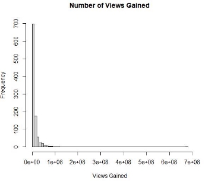|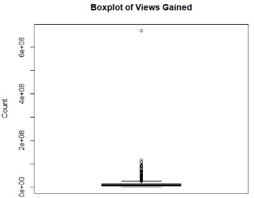|
| - | - |

|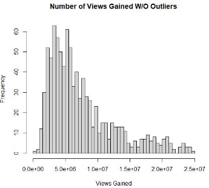|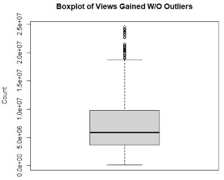|
| - | - |
For the *Views Gained* variable, according to the summary statistics, the median is between the mode and the mean. This causes the histogram to be right skewed. According to the boxplot, there are also a huge number of outliers present in the data. After removing these outliers, it is apparent that the histogram is still right skewed but the data is distributed more evenly. The boxplot of watch time without outliers also shows that there are outliers present in the data. However, compared to the original boxplot, the new boxplot supports my conclusion that the new data is distributed more evenly.

**Partnered:**

True or false value representing whether a streamer is a Twitch Partner (True: Partnered, False: Not Partnered). In order to qualify to be a Twitch Partner streamers have to stream for 25 hours, stream on 12 different days, and hold an average of 75 viewers.

A large majority of creators in the top 100 streamers are partnered with 97.8% partnered while only 2.2% are not.

**Mature:**

True or false value representing if the streamer streams mature content or not (True:18+ content, False: family friendly content).

23% of streamers have content that they consider 18+ while the other 77% are considered family friendly.

**Language:**

What language a streamer streams in.

English is obviously the most popular language among the top 1000 streamers on the platform with 48.5% of streamers using the language. 2nd is Korean with 7.7% and 3rd is Russian with 7.4%.

**Part 2:**

For all tests the *a* value 0.05 will be used.

**1:**

For the first test, I had the question “**Is there a significant difference in the mean of *Views Gained* based on the *Maturity* rating?**”. I explored this using ANOVA due to it being very forgiving with its assumptions. In this test I’ll be assuming normality, equal variance and independence.

This question is very interesting as it may give an insight into why there are so many more family friendly streamers than mature streamers.

First I filtered out all rows that contain an outlier in the *Views Gained* column. By removing outliers, we are able to get a better look at what is actually going on in the data.

Then I plotted a boxplot of *Views Gained* based on *Maturity*.

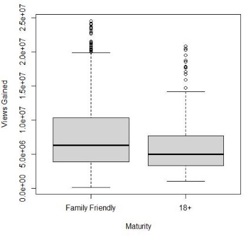

Based on the boxplots, it seems that the variance in views gained for family friendly content is greater than the variance in 18+ content. While the variances aren’t equal, we should still be able to perform a rough test using ANOVA. The family friendly boxplot seems to have a higher views gained than the 18+ group but by conducting an ANOVA test, we can verify the difference.

**H :** μ = μ

0  0 1

**H :** μ ≠ μ

1  0 1

As the P value  = 4.949669\*10-5 is less than a = 0.05, there is sufficient evidence that at least one of the mean *Views Gained* differs.

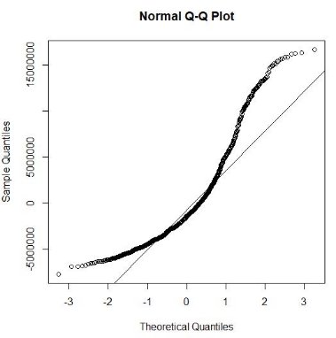

In order to check how good the normality assumption of ANOVA is for this data that I used, I plotted the QQ-plot. From looking at the graph, it seems that the plot follows the straight line in the middle but it curves away at the edges of the graph. This indicates that the data is skewed. However, since most of the line is followed and the sample size is large (906 in this instance), I would say that the Central Limit Theorem has kicked in and the normality assumption is valid here.

**2:**

As an extension to the first test, my second question is “**Do family friendly streamers have higher views gained than 18+ streamers?**” I’ll explore this question with an unpaired t-test due to it being able to take 2 variables and give insight into which mean is greater along with confidence intervals. I’ll be assuming normal distribution, independent sampling, and similar variance. While the data isn’t very normal, I will be removing all rows with outliers in order to create a more normal distribution. I would be correct in assuming independent sampling and similar variance (from the boxplot above).

**H0:** μFamily = μ18+ **H1:** μFamily > μ18+

Since the p-value of 4.151\*10-6 is less than 0.05, we reject H0. We have enough evidence to conclude that streamers that stream family friendly content gained more views throughout the past year than streamers that stream mature content. Along with that, we are 95% confident that family friendly streamers have views gained that are 1026292 more than 18+ streamers. Also, The mean of views gained for family friendly streamers is 7882928 vs 6265476 for mature streamers.

From this analysis, it is obviously more compelling to the Twitch community to be more appealing to all people rather than a select few. In the real world, this may also lead to a monetary incentive for streamers to produce content that all people can enjoy. This may be contributing to the difference in number of streamers for both audiences, there are a lot more family friendly streamers than 18+ streamers.

**3:**

For my final test, my question is “**Do Korean streamers have higher follower counts than Chinese streamers?”** I’ll explore this question with an unpaired t-test for the same reasons as the last test. In applying this method I’ll be assuming normal distribution, independent sampling, and similar variance. While the data isn’t very normal, I will be removing all rows with outliers in order to create a more normal distribution. I would be correct in assuming independent sampling and similar variance. Similar variance can be proven through boxplots.

First I filtered out all rows that contain an outlier in the *Followers* column. By removing outliers, we are able to get a better look at what is actually going on in the data.

Then I plot a boxplot to verify similar variances.

In this case, the variances are pretty similar with the Chinese follower count mean slightly lower than the Korean Follower count. By performing the one sided unpaired t-test, we will be able to verify this.

**H0:** μKorean = μChinese **H1:** μKorean > μChinese

Since the p-value of 0.1461 is greater than 0.05, we fail to reject H0. We don’t have enough evidence to conclude that the mean followers for Korean and Chinese Streamers are different.

I find this very interesting as I initially chose these 2 languages expecting Korean Streamers to have a much higher follower count. While their respective countries are close in proximity to each other, Twitch is actually banned in China and I assumed that this would cause a huge deflation in follower count. Apparently there are enough Chinese speakers that watch Twitch outside of China in order to keep the mean followers on par with Korea. However, considering that Mandarin is the second most spoken language in the world, my initial assumption holds true. There are not nearly as many people that watch Twitch in Chinese as there would be, had it not been banned.
